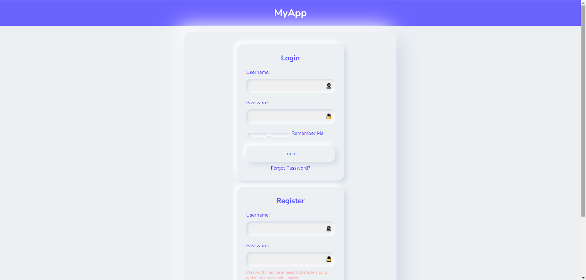
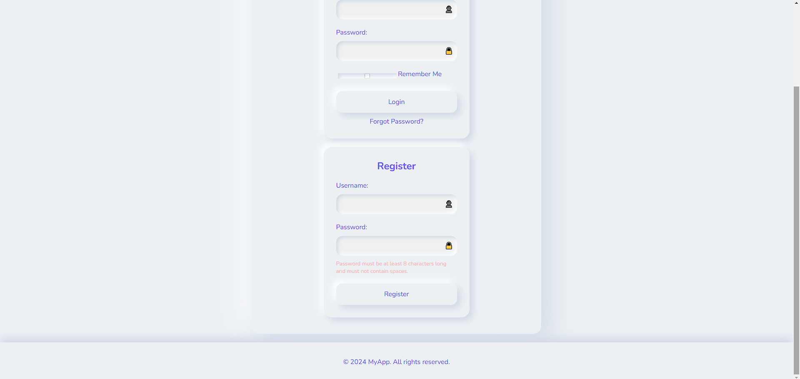

---
# :star: Login/Registration Form
This project provides a simple login and registration form as a test exercise for practicing web development skills. It includes basic features like user authentication, input validation, and feedback messages.

# :camera: Screenshots

# :sparkles: Features
- User authentication (Login and Registration)
- Remember me functionality
- Error and feedback messages for user guidance

# :hammer_and_wrench: Stack used

**Front-end:** 
- HTML
- CSS
- JavaScript

**Back-end:** 
- None (Uses localStorage for data storage)

## :busts_in_silhouette: Authors
- [@imbiel-dev](https://www.github.com/imbiel-dev)